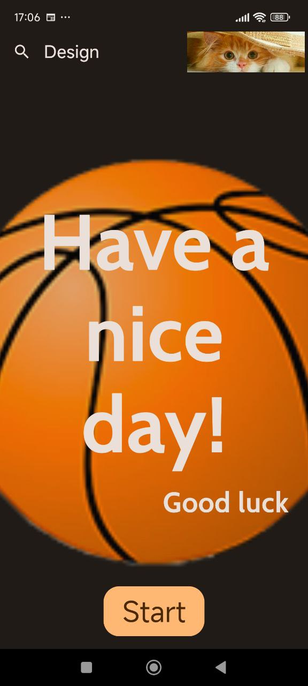
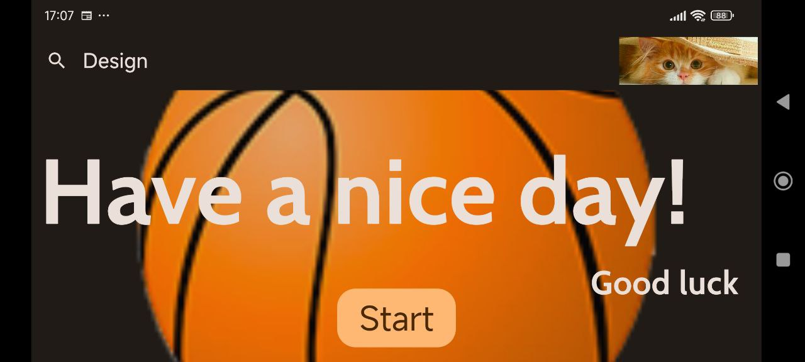

# Android Studio + Kotlin + Compose + Samples

## Пример ""Экран приветствия"

| Project |My Favorite Kotlin | GreetingScreen  |
|:-----|---------|---------|
| | | • Box  • Image • Text  • Button • Padding
|  |  | |

### Способы вертикального выравнивания:

 1)По высоте строки;

 2)Центрирование - одинаковый верхний и нижний отступ по внутреннему краю ограничивающей рамки;

 3)Интервал - используйте высоту ограничивающей рамки, а также верхнее и нижнее поля для определения интервала.

 
## Design & Screenshots 

